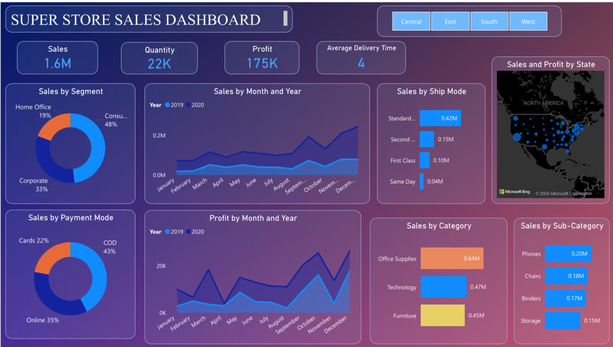

# 📊 SuperStore Sales Dashboard | Power BI

An interactive **Sales Analytics Dashboard built with Microsoft Power BI** using the SuperStore dataset to analyze sales, profit, customers, products, regions, shipping, returns, and payment methods.

This project demonstrates an end-to-end **Data Analytics and Business Intelligence workflow**, from raw transactional data to an interactive dashboard.

---

## 📸 Dashboard Preview



---

## 📌 Project Overview

The objective of this project is to transform raw SuperStore transactional data into an interactive Power BI dashboard that helps analyze business performance and identify important sales and profitability trends.

The dashboard provides a consolidated view of:

* Sales performance
* Profitability
* Orders and quantities
* Customer segments
* Product categories and sub-categories
* Regional performance
* Shipping modes
* Returns
* Payment methods
* Time-based sales trends

---

## 🎯 Business Objectives

The project focuses on answering key business questions such as:

* What is the overall sales and profit performance?
* Which product categories generate the most sales?
* Which categories and sub-categories are most profitable?
* Which regions contribute the most to sales?
* Which customer segments generate the highest revenue?
* Which products perform best?
* How do sales change over time?
* Which shipping modes are most frequently used?
* How are different payment methods being used?
* Where are potential areas of poor profitability or returns?

---

## 🗂️ Dataset

The project uses a SuperStore sales dataset containing **5,901 records and 23 columns**.

### Important Dataset Fields

| Field         | Description                     |
| ------------- | ------------------------------- |
| Order ID      | Unique order identifier         |
| Order Date    | Date when the order was placed  |
| Ship Date     | Date when the order was shipped |
| Ship Mode     | Shipping method                 |
| Customer ID   | Customer identifier             |
| Customer Name | Customer name                   |
| Segment       | Customer segment                |
| Country       | Country                         |
| City          | Customer city                   |
| State         | Customer state                  |
| Region        | Sales region                    |
| Product ID    | Product identifier              |
| Category      | Product category                |
| Sub-Category  | Product sub-category            |
| Product Name  | Product name                    |
| Sales         | Sales amount                    |
| Quantity      | Quantity sold                   |
| Profit        | Profit generated                |
| Returns       | Return information              |
| Payment Mode  | Payment method                  |

---

## 🛠️ Tools & Technologies

* **Microsoft Power BI** — Dashboard development and visualization
* **Power Query** — Data cleaning and transformation
* **DAX** — Measures and calculated metrics
* **CSV** — Source dataset
* **GitHub** — Project documentation and version control

---

## 🔄 Project Workflow

```text
Raw SuperStore Dataset
        ↓
Data Import
        ↓
Data Cleaning & Transformation
        ↓
Data Preparation
        ↓
Data Modeling
        ↓
DAX Calculations
        ↓
Interactive Visualizations
        ↓
Power BI Dashboard
        ↓
Business Insights
```

---

## 🧹 Data Preparation

The dataset was prepared for analysis before creating the dashboard.

The preparation process included:

* Reviewing dataset structure
* Checking data types
* Preparing date fields
* Handling missing values
* Reviewing numerical fields
* Preparing categorical dimensions
* Validating sales and profit fields
* Preparing the data for visualization and analysis

---

## 📊 Key KPIs

The dashboard focuses on important business performance indicators such as:

* **Total Sales**
* **Total Profit**
* **Total Quantity**
* **Total Orders**
* **Average Order Value**
* **Profit Margin**

These KPIs provide a quick overview of overall business performance.

---

## 📈 Dashboard Analysis

### 1. Sales Analysis

Analyze sales performance across:

* Time
* Category
* Sub-category
* Region
* State
* Customer segment
* Products

### 2. Profit Analysis

Analyze profitability by:

* Category
* Sub-category
* Region
* Product
* Customer segment

This helps identify both profitable and underperforming areas.

### 3. Customer Analysis

The dataset allows customer performance to be analyzed using:

* Customer segment
* Customer
* Region
* Sales contribution
* Order activity

### 4. Product Analysis

Product performance can be evaluated based on:

* Sales
* Profit
* Quantity
* Category
* Sub-category

### 5. Regional Analysis

The dashboard supports geographical analysis across:

* Regions
* States
* Cities

This helps identify areas with stronger or weaker business performance.

### 6. Shipping Analysis

Shipping performance can be analyzed using different shipping modes, helping understand the distribution of orders across delivery methods.

### 7. Payment Analysis

The dataset also contains payment method information, allowing analysis of customer payment preferences.

### 8. Returns Analysis

Return-related information can be used to identify products or areas associated with returned orders.

---

## 🧮 DAX

DAX was used to create measures and calculated metrics required for dashboard analysis.

Example:

```DAX
Total Sales = SUM(SuperStore[Sales])
```

```DAX
Total Profit = SUM(SuperStore[Profit])
```

```DAX
Total Quantity = SUM(SuperStore[Quantity])
```

```DAX
Total Orders = DISTINCTCOUNT(SuperStore[Order ID])
```

Additional calculations can be used for profitability, averages, trends, and other business KPIs.

---

## 💡 Business Insights

The dashboard can be used by business stakeholders to identify:

* High-performing product categories
* High-profit and low-profit products
* Strong and weak geographical regions
* Customer segments contributing significantly to revenue
* Sales trends over time
* Shipping method distribution
* Payment method preferences
* Potential areas requiring improvement

> **Note:** Specific numerical findings should be interpreted directly from the dashboard rather than assumed from the dataset alone.

---


## 📚 Skills Demonstrated

This project demonstrates practical experience with:

* Data Cleaning
* Data Transformation
* Exploratory Data Analysis
* Data Modeling
* Power Query
* DAX
* KPI Development
* Data Visualization
* Business Intelligence
* Dashboard Development
* Business Analysis
* GitHub Documentation

---


## 👨‍💻 Author

**Md Arshad Raza**

B.Tech — Computer Science & Engineering (AI & ML)


Skills: ** Excel | Power BI | SQL | Python | Data Analytics**

---
